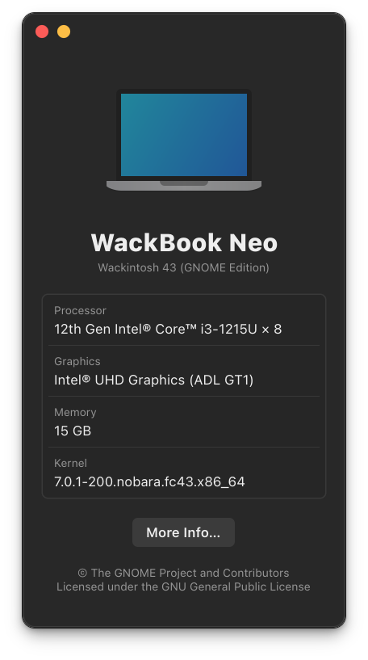

# cupertino-aboutpane

A macOS-style "About This System" window for Linux, built with GTK4 and Libadwaita. Designed as a companion to [WACK Shell](https://github.com/rinzler69-wastaken/wack-shell) — hooks directly into the Logo Menu's "About My System" action when installed.

<p align="center">
  
</p>

## Features

Displays a clean, minimal system info window with:

- **Device name** — resolved from DMI product name/version, with Lenovo-style suffix stripping and `hostnamectl --pretty` as primary source
- **OS** — pretty name from `/etc/os-release`
- **Processor** — model name from `/proc/cpuinfo` with clock speed stripped and core count appended (e.g. *Intel® Core™ i5-1235U × 12*)
- **Graphics** — driver-aware GPU name resolved via `/sys/class/drm` and `/usr/share/hwdata/pci.ids`, with vendor branding (Intel® / AMD / NVIDIA®) and codename annotations; falls back to `lspci`
- **Memory** — total from `/proc/meminfo`, with speed and type from `dmidecode` when available
- **Kernel** — running kernel version
- **Serial number** — from DMI, shown only when present and non-generic
- **More Info…** button — opens GNOME Control Center's About panel
- Single-instance enforcement via abstract Unix socket — re-raises the existing window instead of spawning a second one
- Chassis-aware icon — laptop vs desktop

## Dependencies

- Python 3
- GTK4 (`libgtk-4`)
- Libadwaita (`libadwaita-1`)
- `python3-gobject` (PyGObject)
- `hwdata` — for GPU PCI ID lookup (optional, falls back to `lspci`)
- `dmidecode` — for memory speed/type (optional, requires sudo or polkit)

These are standard on most GNOME-based distros (Fedora, Ubuntu, etc.).

## Install

```bash
git clone https://github.com/rinzler69-wastaken/cupertino-aboutpane.git
cd cupertino-aboutpane
make install          # installs to ~/.local/bin + ~/.local/share/applications
```

Or system-wide (requires sudo):

```bash
sudo make install-system
```

Make sure `~/.local/bin` is in your `PATH` for the user install.

## Uninstall

```bash
make uninstall          # remove user install
sudo make uninstall-system  # remove system-wide install
```

## Usage with WACK Shell

Once installed, WACK Shell automatically detects `aboutpane` in `/usr/local/bin` or `~/.local/bin` and uses it when "About My System" is clicked from the Logo Menu. No configuration needed. Installation status is shown in WACK Shell's preferences under Menu Options.

It also works as a standalone app — launch it from your app grid or run `aboutpane` in a terminal.

## About the WACK Project

WACK (WACK Ain't Cupertino, Kid) brings the best design patterns from macOS to the GNOME desktop — dock animations, panel elements, lockscreen layout, and more — built entirely within what GNOME already gives you.

Other projects in the suite:
- **[WACK Shell](https://github.com/rinzler69-wastaken/wack-shell)** — logo menu, app menu, workspace widget, panel proximity coloring
- **[WACK Sonoma Lockscreen](https://github.com/rinzler69-wastaken/wack-sonoma-lockscreen)** — macOS Sonoma-style lockscreen clock
- **[Cupertino Dock Lite](https://github.com/rinzler69-wastaken/cupertino-dock-lite)** — macOS-inspired dock theming and bounce animations
